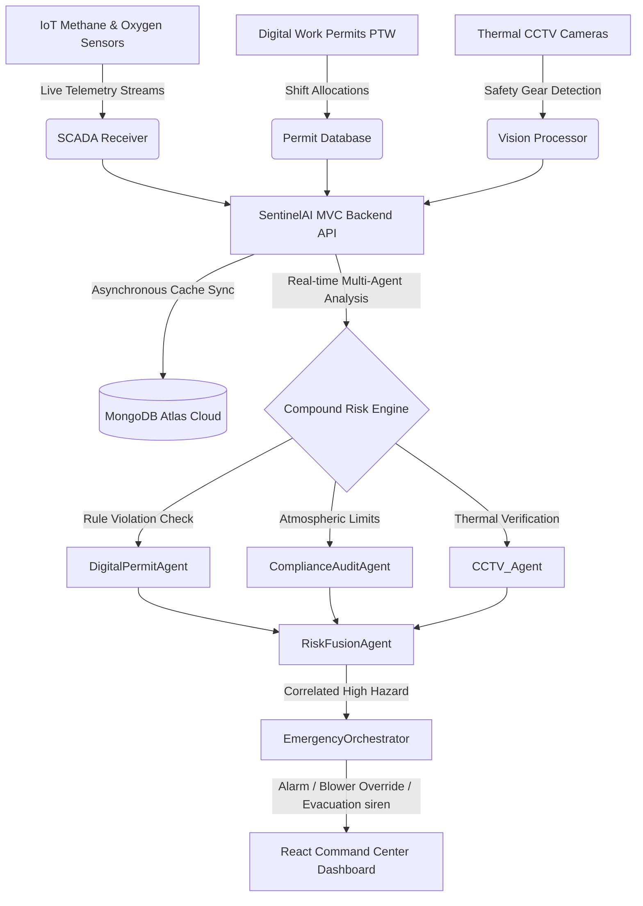
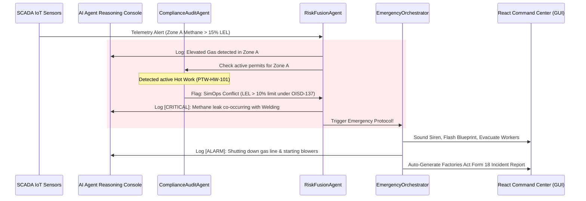

# SentinelAI: AI-Powered Industrial Safety Intelligence
> **ET AI Hackathon 2.0 - Phase 2 Submission (Prototype Build Sprint)**  
> **Theme:** Industrial Intelligence / Worker Safety / Geospatial Safety Analytics  
> **Problem Statement 1:** AI-Powered Industrial Safety Intelligence for Zero-Harm Operations

---

## 📌 The Critical Industry Context: Why SentinelAI?
In January 2025, a sudden gas explosion in a coke oven battery at the **Visakhapatnam Steel Plant** claimed 8 lives. The investigation revealed that **warning signals from gas sensors existed in SCADA, but there was no intelligence layer to correlate those readings with active maintenance operations (Hot Work permit) in real time.**

SentinelAI solves this structural gap. It acts as an active **Compound Risk Detection and Mitigation Overlay** that fuses live SCADA telemetry, digital Work Permits (PTW), thermal camera alerts, and statutory safety directives (OISD, Factory Act) into a single predictive safety cockpit.

---

## ⚙️ System Architecture

The application is built on a high-capacity MERN stack following a strict MVC controller logic. It utilizes an **asynchronous caching loop** to separate real-time dashboard responsiveness from external database transaction delays, ensuring zero-lag safety operations.



---

## 🤖 Multi-Agent Safety Coordination Workflow

SentinelAI coordinates plant safety through specialized autonomous agents communicating in real time:



---

## 🌟 Key Platform Features (Phase 2 Prototyped)

### 1. Geospatial Safety Heatmap (Interactive Blueprint)
- **Active Piping Fluid Flow:** Moving lines that speed up and turn **red** during active hazard triggers.
- **Worker Tracking & Evacuation Visualizer:** Displays live worker icons wandering inside their zones. Upon alert activation, **workers dynamically run to the Safe Assembly Point in real time** with pulsing panic radar animations.
- **Clickable Nodes:** Drill down into Zone A (Coke Oven), Zone B (Refinery), or Zone C (Storage Tank) telemetry graphs instantly.

### 2. Live Telemetry & AI Camera Simulation
- **Area Charts:** Displays rolling telemetry data (LEL% for Methane, % for Oxygen) using `Recharts` scaling.
- **CCTV Bounding Boxes:** Simulates thermal feed CAM_04, automatically switching to a red hazard warning overlay when safety violations are detected.

### 3. SimOps Conflict Prevention Engine (PTW Form)
- Prevents accidents *before* authorization. If an operator tries to issue a **Hot Work** permit while gas readings are > 10% LEL, or a **Confined Space Entry** permit while Oxygen is < 19.5%, a prominent yellow alert box displays:
  > **⚠️ CONFLICT WARNING (OISD-STD-137):** Live Methane in Zone A is currently at 18% LEL. Hot Work authorization is restricted.

### 4. RAG Copilot & Regulation Corpus Browser
- **Regulation Chatbot:** Ask regulatory safety questions. Features preset suggestions for "Hot Work Rules" or "Confined Space Guidelines".
- **Standard Reference Manuals:** In-app browser allowing safety officers to search standard reference pages from **OISD Standard 137** and the **Factories Act 1948** side-by-side.

### 5. Factories Act Form 18 Accident Report
- Generates an official, print-ready accident report modeled after the Indian Factories Act **Form 18** (Section 88) on alert trigger, capturing SCADA history, active permit IDs, and evacuation statuses.

---

## 🛠️ Installation & Setup Guide

### 1. Backend Server Setup
1. Open your terminal and navigate to the backend directory:
   ```bash
   cd backend
   ```
2. Install dependencies:
   ```bash
   npm install
   ```
3. Set up environment variables in a `.env` file:
   ```env
   PORT=5000
   MONGO_URI=mongodb+srv://<username>:<password>@cluster0.mongodb.net/safety-db
   ```
4. Start the backend:
   ```bash
   node index.js
   ```
   *The console will log `Server running on port 5000` and start the AI Safety Simulation Engine.*

### 2. Frontend Dashboard Setup
1. Open a new terminal tab and navigate to the frontend directory:
   ```bash
   cd frontend
   ```
2. Install dependencies:
   ```bash
   npm install
   ```
3. Start the dev server:
   ```bash
   npm run dev
   ```
4. Open your browser and navigate to **http://localhost:5173**.

---

## 🧪 Simulation Scenarios to Test & Record for Demo Video

To record a high-impact 3-minute demo video for your hackathon submission, showcase the following transitions:

### Scenario 1: The Zero-Harm Safety Index & Simulation
- **Observe:** On startup, the dashboard displays in a clean, premium **Light Mode** design. The Safety Health Index displays a green **100% (FULLY COMPLIANT)** score.
- **Worker Movement:** Note the worker nodes moving around their zones, indicating active workers.

### Scenario 2: Smart SimOps Prevention Alert
- Navigate to the **Permit to Work Manager** tab.
- Wait until the telemetry in **Zone A** cycles above 10% LEL. Try issuing a **Hot Work** permit in Zone A.
- **Observe:** The SimOps Conflict Engine instantly triggers a warning alert citing **OISD-STD-137** limits, blocking dangerous simultaneous work before it happens.

### Scenario 3: Real-Time Risk Fusion & Evacuation Anomaly
- Let the simulation run. The backend will randomly generate elevated gas levels in **Zone A** (LEL > 15%) while the default **Hot Work** permit is active.
- **Observe:**
  1. The **Safety Health Index** drops to **45% (HAZARD RULE VIOLATION)**.
  2. Zone A on the blueprint flashes red, and pipelines speed up, flowing in red.
  3. **The two workers in Zone A run to the Safe Assembly Point** with pulsing red warning animations.
  4. The scrolling **AI Agent reasoning logs** display critical red alerts from the `RiskFusionAgent` and `EmergencyOrchestrator`.
  5. The AI camera feed switches to red warning mode.

### Scenario 4: Regulatory Form 18 Incident Report
- Navigate to the **Emergency Control Room** tab.
- Click **"Generate Form 18 Incident Report"**.
- **Observe:** An official Factories Act accident form loads, populated with live sensor metrics, active permit IDs, and worker safety status. Click "Print Form" to show printing capability.
